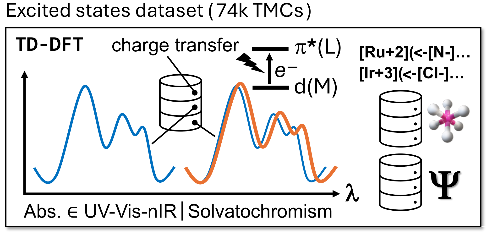

# tmQMg*

This repository contains the quantum chemistry dataset tmQMg* containing excitation data for 74,281 transition metal complexes (TMCs). It is derived from the graph dataset [tmQMg](https://github.com/uiocompcat/tmQMg) featuring TMCs including all thirty elements from the 3d, 4d, and 5d series. This dataset contains data such as the maximum absorption wavelengths and oscillator strengths as well as band broadness in the visible, ultraviolet and near-infrared ranges. Furthermore, the nature of charge transitions corresponding to the strongest excitation in the visible range has been determined for each TMC. All data has been determined in gas phase and acetone so that additional solvatochromism data could be determined. A detailed discussion of the data can be found in the corresponding [publication](https://doi.org/10.26434/chemrxiv-2025-pdd8p).

## Data

###### [tmQMg*.csv](tmQMg*.csv)
- CSV file containing all relevant excitation and solvatochromism data described in the associated publication.

## Code

Furthermore, we provide here the Python scripts used to extract the data.

###### [analysis/analyze.py](analysis/analyze.py)
- Code to compile relevant TD-DFT and NTO data for a given directory of Gaussian output files. The argument given to the script is the path to the directories containing the Gaussian output files for all TMCs in either gas phase or acetone.

###### [analysis/merge.py](analysis/merge.py)
- Code to merge the extracted excitation data from gas phase and acetone calculations and to compute corresponding solvatochromism data.

###### [analysis/tddft_data_parser.py](analysis/tddft_data_parser.py)
- Class for extracting TD-DFT data from a Gaussian output file.

###### [analysis/nto_data_parser.py](analysis/nto_data_parser.py)
- Class for extracting NTO data from a Gaussian output file.

